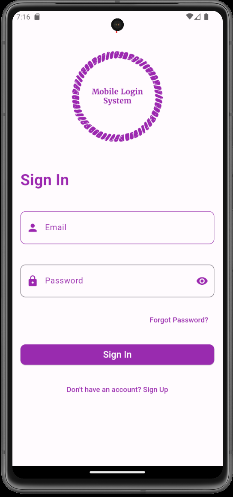
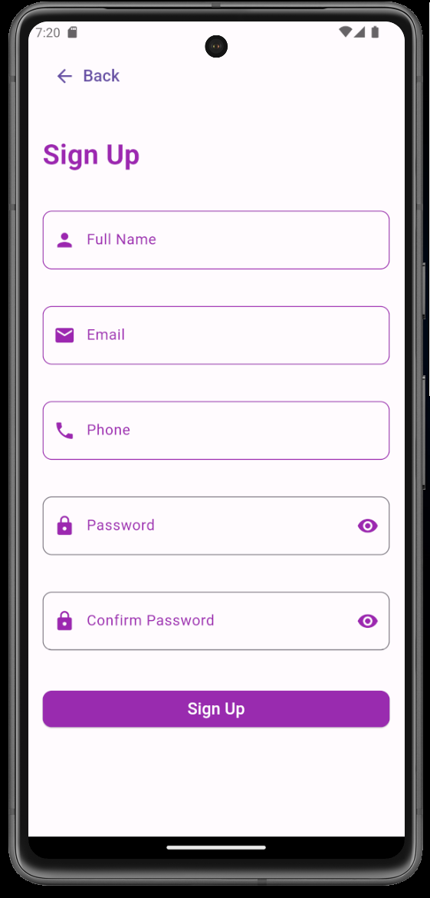
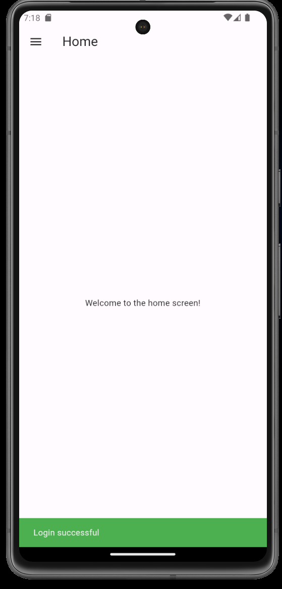
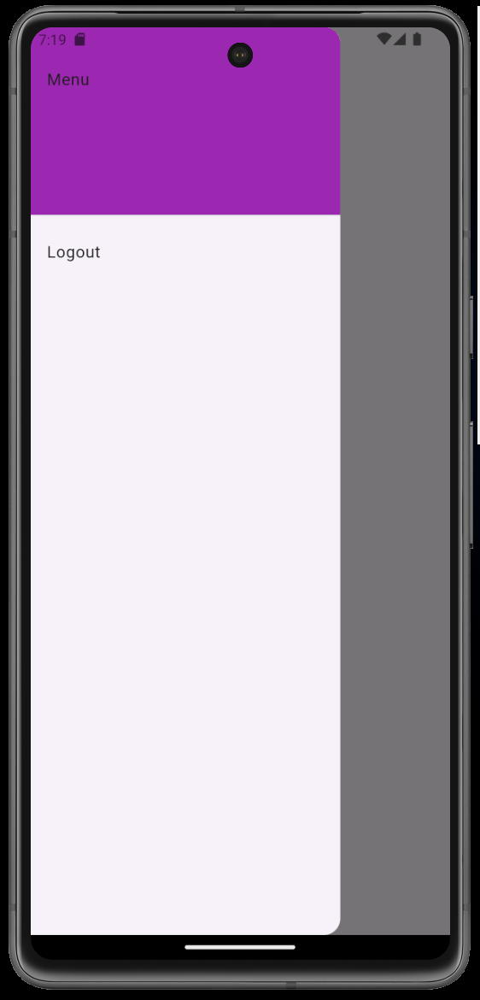
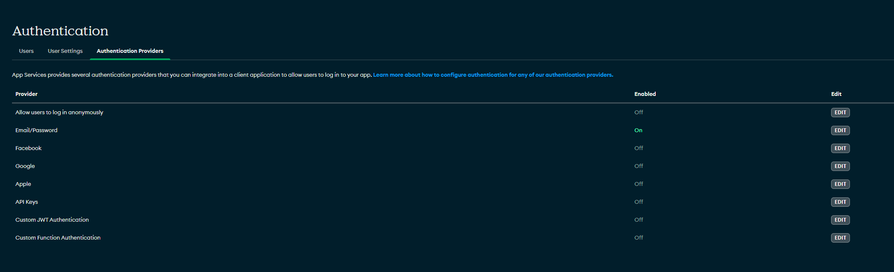

# Mobile Login System

Mobile Login System is a mobile application built with Flutter and MongoDB Realm. It provides user authentication features, allowing users to register, log in, and log out.

## Features

- User Registration: New users can create an account using their email and password.
- User Login: Registered users can log in to the app.
- User Logout: Logged-in users can log out from the app.

## App Demo

The following are some screenshots of the application.

*Screenshot 1: Sign In Screen*



*Screenshot 2: Sign Up Screen*



*ScreenShot 3: Home Screen*




*ScreenShot 4: Custom Drawer*




<!--  -->


## Getting Started

These instructions will get you a copy of the project up and running on your local machine for development and testing purposes.

### Prerequisites

- Flutter SDK
- Dart SDK
- Android Studio or VS Code
- A MongoDB Realm account

### Setting Up MongoDB Atlas App Service

Please follow the offical documention on how to create an app service.


[MongoDB] (https://www.mongodb.com/docs/atlas/app-services/)

Once the app service is up and running, make sure to enable Email/Password Authentication.



To learn more about the auth system used by app services follow the following link.
[Authenticate & Manage Users] (https://www.mongodb.com/docs/atlas/app-services/users/)

You will also need your AppId. For instructions please follow the following link.

[Get App Metadata] (https://www.mongodb.com/docs/atlas/app-services/apps/metadata/)

### Setting up .env file

Create a file .env file in the root of the repository and update with AppId.

```
REALM_APP_ID = 'Your_App_Id'
```

### Running the Application

Once you updated the .env file, please run the application as any other Flutter project.
